# WeBookkeep

A bookkepping system for personal finances based on the double-entry method, used all around the world for managing business and accounting.

## TODO Backlog

- ✅ Initialize project
- ✅ Initialize backlog
- ✅ Application modeling
- 🔲 Implement initial frontend
  - 🔲 log in page
  - 🔲 edit user page
  - ✅ edit book page
  - ✅ view books
  - ✅ view a single book
  - ✅ edit a single book
  - ✅ edit transaction page
  - ✅ transactions page
  - ✅ edit accounts page
  - ✅ view accounts
- 🔲 Implement main entities classes w/ tests
- 🔲 Update documentation
- 🔲 Implement db
- 🔲 Public deploy

---

## Application model

### Use Cases

```mermaid
---
config:
  layout: elk
  look: classic
  theme: dark
  displayMode: compact
  markdownAutoWrap: false
  elk:
    mergeEdges: true
    nodePlacementStrategy: LINEAR_SEGMENTS
  flowchart:
    htmlLabels: false
    compact: true
---

flowchart TD
uc1([Register transactions])
uc2([View transactions])
uc3([View results])
uc4([View values])
uc5([Edit accounts])
uc6([Log In])
uc7([Edit books])
uc8([View books])
uc9([Create user])

client[Client👩‍🦰👳🏾🧔🏻]
client-->uc1
client-->uc2
client-->uc3
client-->uc4
client-->uc5
client-->uc6
client-->uc7
client-->uc8
client-->uc9
```



### Entity-Relationship Diagram


### Some Design Patterns to implement

We can use the following design patterns on the project (among other options):

- Builder, to simplify and clarify the Transaction constructor, e.g.:

  ```JS
    Transaction transaction = new Transaction.Builder()
        .withDescription("Almoço")
        .withValue(50)
        .fromAccount(carteira)
        .toAccount(restaurantes)
        .build();
  ```

- Adapter, to integrate with external APIs for retrieving transactions (e.g. Nubank, Itaú, etc)
- Repository, to isolate data access from business logic

---

## React + TypeScript + Vite

This template provides a minimal setup to get React working in Vite with HMR and some ESLint rules.

Currently, two official plugins are available:

- [@vitejs/plugin-react](https://github.com/vitejs/vite-plugin-react/blob/main/packages/plugin-react) uses [Babel](https://babeljs.io/) for Fast Refresh
- [@vitejs/plugin-react-swc](https://github.com/vitejs/vite-plugin-react/blob/main/packages/plugin-react-swc) uses [SWC](https://swc.rs/) for Fast Refresh

### Expanding the ESLint configuration

If you are developing a production application, we recommend updating the configuration to enable type-aware lint rules:

```js
export default tseslint.config([
  globalIgnores(["dist"]),
  {
    files: ["**/*.{ts,tsx}"],
    extends: [
      // Other configs...

      // Remove tseslint.configs.recommended and replace with this
      ...tseslint.configs.recommendedTypeChecked,
      // Alternatively, use this for stricter rules
      ...tseslint.configs.strictTypeChecked,
      // Optionally, add this for stylistic rules
      ...tseslint.configs.stylisticTypeChecked,

      // Other configs...
    ],
    languageOptions: {
      parserOptions: {
        project: ["./tsconfig.node.json", "./tsconfig.app.json"],
        tsconfigRootDir: import.meta.dirname,
      },
      // other options...
    },
  },
]);
```

You can also install [eslint-plugin-react-x](https://github.com/Rel1cx/eslint-react/tree/main/packages/plugins/eslint-plugin-react-x) and [eslint-plugin-react-dom](https://github.com/Rel1cx/eslint-react/tree/main/packages/plugins/eslint-plugin-react-dom) for React-specific lint rules:

```js
// eslint.config.js
import reactX from "eslint-plugin-react-x";
import reactDom from "eslint-plugin-react-dom";

export default tseslint.config([
  globalIgnores(["dist"]),
  {
    files: ["**/*.{ts,tsx}"],
    extends: [
      // Other configs...
      // Enable lint rules for React
      reactX.configs["recommended-typescript"],
      // Enable lint rules for React DOM
      reactDom.configs.recommended,
    ],
    languageOptions: {
      parserOptions: {
        project: ["./tsconfig.node.json", "./tsconfig.app.json"],
        tsconfigRootDir: import.meta.dirname,
      },
      // other options...
    },
  },
]);
```
